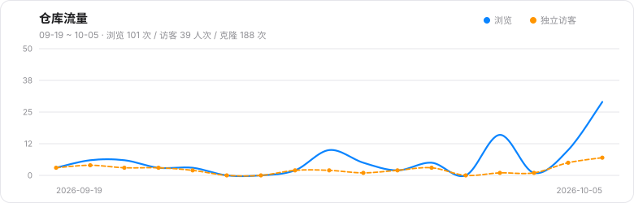

# 青龙脚本合集

本目录收集适配青龙面板的 Python 定时任务脚本。每个脚本已放入同名文件夹，并提供独立 `README.md`。

## 脚本列表

| 脚本 | 说明 | 文档 | 青龙任务命令 |
|---|---|---|---|
| E-Hentai 自动签到 | E-Hentai 每日签到领 Exp/Credits，Cookie 认证，TLS 1.2 回退 + Cookie 过期预警 | [AkiyaKiko_EhentaiAutoSignIn/autosignin.py](AkiyaKiko_EhentaiAutoSignIn/autosignin.py) | `task AkiyaKiko_EhentaiAutoSignIn/autosignin.py` |
| 老王FIP签到（浏览器版） | Discuz + tncode 滑块 + 前端 JS 签名，使用 Playwright + OpenCV 自动登录签到 | [laowangfip_browser_checkin/README.md](laowangfip_browser_checkin/README.md) | `task laowangfip_browser_checkin/laowangfip_browser_checkin.py` |
| New API 站点自动签到 | 多站点 API/Discuz 签到，内置 Liminality 贝之/可萌/哈基米/DZZI.AI 等站点并支持 `QZD_CUSTOM` 自定义站点，凭证 token/Cookie 缓存复用 | [newapi_checkin/README.md](newapi_checkin/README.md) | `task newapi_checkin/newapi_checkin.py` |
| whos.tv 签到 | Cookie 签到，带接口探测和代理支持 | [whos_tv_checkin/README.md](whos_tv_checkin/README.md) | `task whos_tv_checkin/whos_tv_checkin.py` |
| SophNet 签到 | www.sophnet.com 福利中心签到，refreshToken 换 accessToken，纯 API 免验证码 | [sophnet_checkin/README.md](sophnet_checkin/README.md) | `task sophnet_checkin/sophnet_checkin.py` |
| iKuuu 签到（Node.js） | ikuuu 机场签到，动态域名 + 多账号 + 状态分档，复用 `sendNotify.js` 全通道推送 | [wuang-wu_Ikuuu/README.md](wuang-wu_Ikuuu/README.md) | `task wuang-wu_Ikuuu/ikuuu.js` |
| gpt.qt.cool 签到 | gpt.qt.cool 签到，Playwright + OpenCV 滑动验证码自动识别，登录态 storage_state 缓存复用 | [gptqtcool_checkin/README.md](gptqtcool_checkin/README.md) | `task gptqtcool_checkin/gptqtcool_checkin.py` |
| 司机社签到 | xsijishe 司机社签到，Cookie 直签或邮箱 + 本地 ddddocr OCR 登录，Cookie 缓存复用 | [xsijishe_checkin/README.md](xsijishe_checkin/README.md) | `task xsijishe_checkin/xsijishe_checkin.py` |
| 采蘑菇论坛回帖签到 | caimogu.cc 自动回帖刷活跃度，Playwright 驱动 + AI/模板双模式评论生成（反套话词库、REPLY/SKIP 判定、防重复回帖） | [caimogu_checkin/README.md](caimogu_checkin/README.md) | `task caimogu_checkin/caimogu_checkin.py` |
| 雨云自动签到 | 雨云服务器签到 + 自动续费，多账号 + 验证码识别，专为青龙面板优化 | [Rainyun/README.md](Rainyun/README.md) | `task Rainyun/main.py` |
| 天翼云盘签到 | cloud189-sdk 登录签到，多账号 + 个人/家庭容量统计，复用 sendNotify.js 全通道推送 | [Cloud189Checkin/README.md](Cloud189Checkin/README.md) | `task Cloud189Checkin/src/app.js` |
| PT 签到（Node.js） | NovaHD / HDArea / BTSchool 三站签到，Cookie 失效自动登录兜底（视觉模型识别验证码），登录限次保护防封 IP | [pt-checkin/README.md](pt-checkin/README.md) | `task pt-checkin/pt_checkin.js` |
| TG签到（tg-signer） | Telegram 群/机器人自动签到，基于 tg-signer 封装，扫码登录多账号，支持发消息+点按钮+定时撤回 | [tg-signer-ql/README.md](tg-signer-ql/README.md) | `task tg-signer-ql/tg_signer_ql.py` |
| ZodGame 签到 | zodgame.xyz 每日签到 + BUX 广告任务（每个 +2 点币），Cookie 认证，幂等跳过，Cookie 失效推送告警 | [zodgame_checkin/README.md](zodgame_checkin/README.md) | `task zodgame_checkin/zodgame_checkin.py` |
| 嘉立创签到 | m.jlc.com 每日签到领金豆，第七天自动领 8 金豆券，AccessToken 认证，幂等跳过，Token 失效告警 | [jlc_checkin/README.md](jlc_checkin/README.md) | `task jlc_checkin/jlc_checkin.py` |
| 纸鸢下载签到 | mybt.kiteyuan.info 每日签到 + 访问任务，Casdoor 账号密码自动登录换 JWT，JWT 缓存复用（401 才重登），多账号 + 网络重试，幂等跳过 | [mybt-checkin-ql/README.md](mybt-checkin-ql/README.md) | `task mybt-checkin-ql/mybt_checkin.py` |
| 福利吧预注册签到 | wnflb2023.com「游客预注册签到」插件，连续签到 30 天转正，Cookie 直签或账号密码登录（验证码 ddddocr 自动识别 + Cookie 缓存），幂等跳过 + 进度统计 | [wnflb_checkin/README.md](wnflb_checkin/README.md) | `task wnflb_checkin/wnflb_checkin.py` |
| 尚香书苑签到 | sxsy45.com Discuz k_misign 签到，登录图片验证码 ddddocr 自动识别 + 算术验证自动计算，Cookie 直签或账密登录（Cookie 缓存复用），幂等跳过 + 签到统计 | [sxsy45_checkin/README.md](sxsy45_checkin/README.md) | `task sxsy45_checkin/sxsy45_checkin.py` |

## 来源与致谢

以下脚本改写/移植自开源项目，按青龙面板规范适配后在本仓库维护，原项目地址一并列出：

| 脚本 | 原项目 |
|---|---|
| 雨云自动签到 | [SerendipityR-2022/Rainyun-Qiandao](https://github.com/SerendipityR-2022/Rainyun-Qiandao) → [fatekey/Rainyun-Qiandao](https://github.com/fatekey/Rainyun-Qiandao) → [Jielumoon/Rainyun-Qiandao](https://github.com/Jielumoon/Rainyun-Qiandao) |
| 天翼云盘签到 | [wes-lin/Cloud189Checkin](https://github.com/wes-lin/Cloud189Checkin)（登录依赖 [wes-lin/cloud189-sdk](https://github.com/wes-lin/cloud189-sdk)） |
| iKuuu 签到 | [wuang-wu/Ikuuu](https://github.com/wuang-wu/Ikuuu) |
| E-Hentai 自动签到 | [AkiyaKiko/EhentaiAutoSignIn](https://github.com/AkiyaKiko/EhentaiAutoSignIn) |
| 嘉立创签到 | [Foticing/LC-AutoSign](https://github.com/Foticing/LC-AutoSign) |
| 纸鸢下载签到 | [elongou-checkin/mybt-signin](https://github.com/elongou-checkin/mybt-signin) |
| New API 站点签到 | [zhangguoguo1314/quan-zidong-zhushou](https://github.com/zhangguoguo1314/quan-zidong-zhushou) |
| TG 签到（tg-signer） | [xuanvivo/tg-signer-ql](https://github.com/xuanvivo/tg-signer-ql)（上游 [amchii/tg-signer](https://github.com/amchii/tg-signer)） |

其余脚本为本仓库原创。感谢上述项目作者的开源工作。

## 迁移提醒

脚本已从根目录移动到子目录。若青龙中已有旧任务，需要同步修改命令：

```text
# 旧
 task xxx.py

# 新
 task xxx/xxx.py
```

例如：

```text
task laowangfip_browser_checkin/laowangfip_browser_checkin.py
task newapi_checkin/newapi_checkin.py
task whos_tv_checkin/whos_tv_checkin.py
```

如果使用 `ql repo` 拉库，请确认订阅过滤规则能扫描到子目录内的 `.py` 文件。

## 通知说明

脚本在青龙环境中会尽量复用青龙自带的 `notify.py`，支持你在青龙里已经配置好的通知渠道，例如 Server酱、PushPlus、企业微信、钉钉、飞书、Bark、Telegram 等。

各脚本都提供独立的通知开关环境变量，详见对应子目录 README。

## 通用运行方式

青龙面板：

1. 上传或订阅本目录脚本。
2. 在「环境变量」中配置对应脚本的变量。
3. 在「定时任务」中新建任务，命令使用上方表格中的新路径。
4. 先手动运行一次，确认日志正常后再启用定时。

本地调试：

```bash
python path/to/script.py
```

Windows PowerShell 中设置环境变量示例：

```powershell
$env:XXX_NOTIFY="false"
python path\to\script.py
```

## 代理配置（重要）

脚本的代理取值优先级固定为三段：

1. 脚本专属变量（如 `LWFIP_PROXY`、`IKUUU_PROXY`、`TG_PROXY`）
2. 青龙全局代理：`HTTPS_PROXY` / `HTTP_PROXY` / `ALL_PROXY`（大小写均可）
3. 都为空则直连（不报错退出）

### 注意：`config.sh` 里的 `ProxyUrl` 对脚本无效

`ProxyUrl` 是**青龙面板自身**的配置项，只用于面板拉库、安装依赖，**不会注入任务脚本的运行环境**。
脚本读不到它，因此「配了 ProxyUrl 却仍提示未配置代理」是正常现象，不是脚本的问题。

要让所有脚本共用一份代理配置，任选其一。

**方式一：青龙「环境变量」页（推荐）**

新增两条，值改成你自己的代理地址：

| 名称 | 值 |
|---|---|
| `HTTP_PROXY` | `http://192.168.5.5:7890` |
| `HTTPS_PROXY` | `http://192.168.5.5:7890` |

> 代理跑在宿主机上时容器内常用 `http://172.17.0.1:7890`；跑在局域网其它机器上则填其实际 IP。
> 保存后新运行的任务即生效。

**方式二：容器级环境变量（docker 部署）**

在 `docker-compose.yml` 的青龙服务下追加：

```yaml
environment:
  - HTTP_PROXY=http://192.168.5.5:7890
  - HTTPS_PROXY=http://192.168.5.5:7890
  - NO_PROXY=localhost,127.0.0.1,192.168.0.0/16,10.0.0.0/8,172.16.0.0/12
```

`NO_PROXY` 用于排除内网，避免青龙访问数据库、NAS 时也被绕进代理。

> 建议代理软件开启**规则模式**：国内域名直连、境外域名走代理。否则国内站脚本（嘉立创、雨云、司机社等）会因绕行而变慢甚至失败。

## 仓库流量

GitHub 只保留最近 14 天的流量数据，这里每周自动抓取并存档到 [`stats/`](stats/README.md)，趋势如下：

[](stats/README.md)
